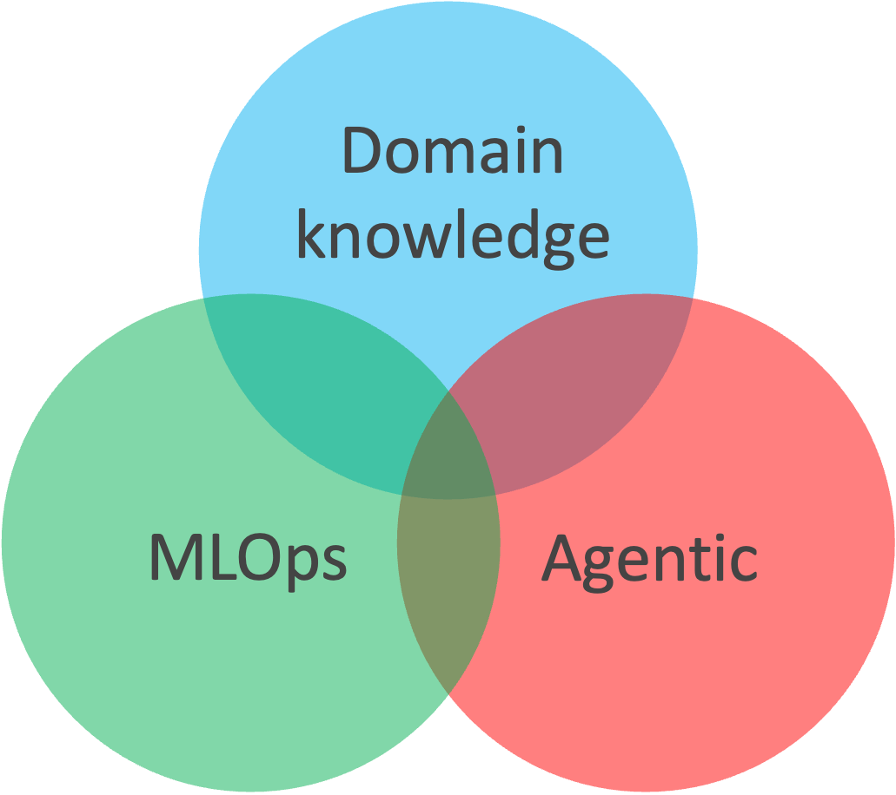
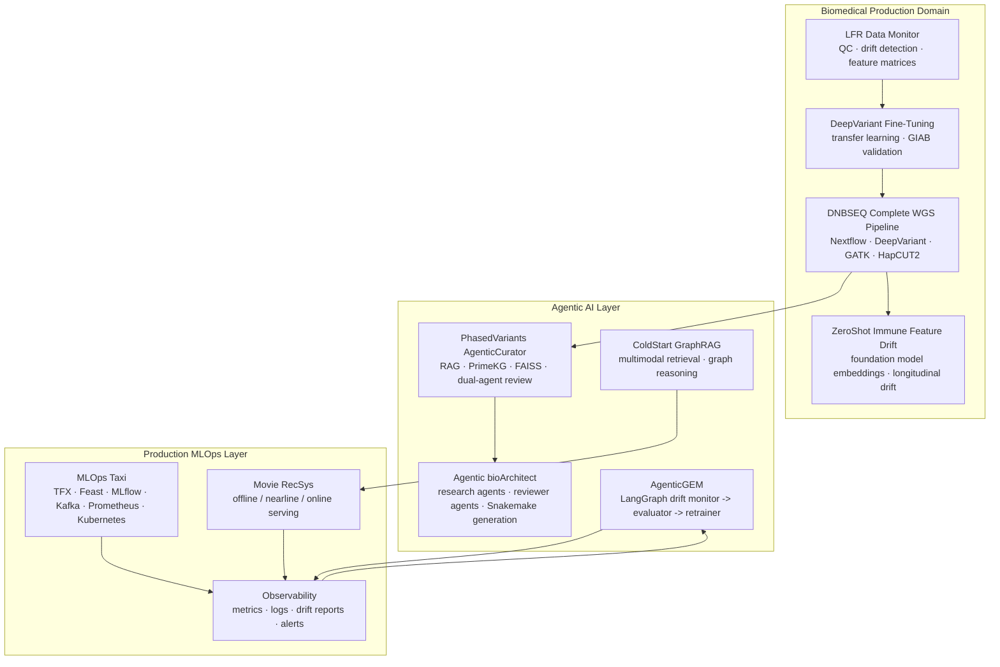

# Production Agentic AI & MLOps Portfolio

## Agentic AI x Production MLOps x Domain Knowledge  

My work sits at the intersection of three factors:

1. **Biomedical domain knowledge**: genomics, variant calling, phasing, sequencing QC, immune aging, and clinical interpretation.
2. **Agentic AI**: multi-agent orchestration, RAG, tool use, reflection loops, evaluator agents, and human-in-the-loop quality gates.
3. **MLOps**: production pipelines, monitoring, drift detection, model retraining, serving, observability, and deployment.

The unifying theme is not simply building models or agents. It is building working agentic loops that can survive real production conditions: noisy data, model drift, long-running workflows, unreliable tool calls, audit requirements, and the need to decide when automation should stop and ask for human review.



## Two Core Signals

1. **Implemented production-style agentic closed loops**: monitor -> evaluate -> decide -> act -> validate. These loops appear in biomedical variant interpretation, bioinformatics pipeline design, sequencing drift response, and ads-ranking retraining.
2. **Designed for agentic stability**: the projects directly address the failure modes that make agents hard to deploy, especially multi-step error compounding, tool-use unreliability, weak evaluation, context degradation, missing observability, and uncontrolled automation.

---

## Portfolio Thesis

Production agentic AI becomes deployable only when the loop is closed: agents must observe system state, make bounded decisions, trigger retraining or refinement, validate outputs, and escalate when confidence is insufficient.

An agent that calls a degraded model, retrieves stale context, silently compounds errors, or cannot explain its tool path is not production-ready. My projects therefore treat agentic AI as one layer in a larger system:

```text
Domain data -> ML pipeline -> monitoring -> drift decision -> retraining / fallback
            -> agentic orchestration -> evaluation -> human review -> deployment
```

This portfolio demonstrates end-to-end ownership across that lifecycle, with stability mechanisms built into the agentic loop rather than added as afterthoughts:

- **Domain grounding**: biomedical projects use real genomics workflows, variant evidence, sequencing QC, and foundation model representations.
- **Agent reliability**: agentic projects include planning, retrieval grounding, reflection, evaluator agents, explicit stop criteria, and hallucination checks.
- **Production readiness**: MLOps projects include feature stores, model registries, drift monitoring, Prometheus/Grafana-style observability, Kubernetes deployment, and automated retraining loops.

---

## Factor Coverage

| Project | Biomedical | Agentic AI | MLOps / Production ML | Core Signal |
|---|:---:|:---:|:---:|---|
| [DNBSEQ Complete WGS Pipeline](https://github.com/Complete-Genomics/DNBSEQ_Complete_WGS) | Yes |  | Yes | Production genomics pipeline with auditable, reproducible WGS analysis |
| [LFR Data Monitor](https://github.com/arcadianlyric/LFR_DataMonitor) | Yes |  | Yes | Sequencing QC and drift detection before model degradation becomes silent |
| [Google DeepVariant Fine-Tuning](https://github.com/arcadianlyric/GoogleDeepVariant_FineTuning) | Yes |  | Yes | Detect -> retrain -> validate pattern for shifted sequencing distributions |
| [PhasedVariants AgenticCurator](https://github.com/arcadianlyric/PhasedVariants_AgenticCurator) | Yes | Yes | Yes | RAG + KG + dual-agent review for grounded variant interpretation |
| [Agentic bioArchitect](https://github.com/arcadianlyric/Agentic_bioArchitect) | Yes | Yes | Yes | Multi-agent design and implementation of bioinformatics pipelines |
| [ZeroShot Immune Feature Drift](https://github.com/arcadianlyric/ZeroShot_ImmuneFeatureDrift) | Yes |  | Yes | Foundation model embedding drift for longitudinal immune monitoring |
| [AgenticGEM DataDrift AutoRetrainer](https://github.com/arcadianlyric/AgenticGEM_DataDrift_AutoRetrainer) |  | Yes | Yes | LangGraph monitor -> evaluate -> retrain loop for ads ranking drift |
| [MLOps Taxi Platform](https://github.com/arcadianlyric/Agentic_MLOps_Platform) |  |  | Yes | Full production ML platform with TFX, Feast, MLflow, Kafka, and observability |
| [RS ColdStart GraphRAG LLM](https://github.com/arcadianlyric/RS_coldstart_graphRAG_LLM) |  | Yes | Yes | Multimodal GraphRAG for cold-start recommendation |
| [Movie RecSys](https://github.com/arcadianlyric/RS_movies) |  |  | Yes | Hybrid recommendation stack with offline, nearline, and online serving layers |

---

## Agentic Stability Pain Points I Address

| Pain Point | Why It Breaks Production | Portfolio Evidence |
|---|---|---|
| Multi-step error compounding | A 95% reliable step becomes unreliable across long chains | AgenticCurator review loop; bioArchitect researcher -> analyst -> reviewer workflow |
| Tool-use unreliability | Agents hallucinate parameters, call tools in the wrong order, or miss failures | Structured retrieval wrappers, explicit tool outputs, cross-model review |
| Evaluation gap | Teams cannot deploy agents without measurable quality gates | Five-dimension scoring rubric in AgenticCurator; automated tests in AgenticGEM |
| Observability blindness | Failures are hard to debug without traces, metrics, and lineage | MLOps Taxi monitoring stack; LFR drift feature matrices; Prometheus metrics in AgenticGEM |
| Context degradation | Long sessions and poor retrieval cause agents to reason from weak context | FAISS grounding, knowledge graph context, progressive literature search |
| Human-in-the-loop design | Agents either over-ask humans or continue when they should stop | Quality thresholds, revise/stop logic, escalation decisions |
| Production drift | ML tools degrade when input distributions shift | LFR DataMonitor, DeepVariant fine-tuning, AgenticGEM retraining loop, ZeroShot drift metrics |

---

## Integrated System View



This view shows the same operating principle across domains:

1. Build a reliable ML or data pipeline.
2. Instrument it with monitoring and drift detection.
3. Use agents where multi-step reasoning, retrieval, or orchestration adds leverage.
4. Add evaluation, reflection, and stop criteria so the agent can be trusted.
5. Close the loop with retraining, fallback, escalation, or human review.

---

## Project Narratives

### 1. Biomedical Production ML Foundation

The biomedical projects show that I understand production constraints before adding agents.

- **DNBSEQ Complete WGS Pipeline** demonstrates reproducible genomics production: Nextflow DSL2, containerized tools, variant calling, phasing, structural variants, and configurable callers.
- **LFR Data Monitor** turns sequencing QC into an ML monitoring problem by extracting per-run features and detecting distribution shifts before they affect downstream calling quality.
- **Google DeepVariant Fine-Tuning** closes the loop by adapting pretrained DeepVariant models to shifted sequencing distributions using transfer learning and GIAB-based validation.
- **ZeroShot Immune Feature Drift** extends the same drift mindset to foundation model embeddings, tracking immune aging signals without overfitting small biological datasets.

Together, these projects represent the production substrate: data quality, model quality, reproducibility, drift awareness, and validation.

### 2. Domain-Specific Agentic AI

The agentic biomedical projects focus on constrained automation rather than unconstrained chat.

- **PhasedVariants AgenticCurator** automates interpretation of phased variants using RAG, PrimeKG, VEP annotations, literature retrieval, FAISS grounding, and dual-agent review.
- **Agentic bioArchitect** uses multi-agent collaboration to design and implement bioinformatics pipelines, with reviewer agents and score thresholds controlling whether the workflow proceeds or iterates.

These systems address the hard parts of agent deployment: evidence grounding, tool reliability, hallucination detection, review loops, and explicit stopping criteria.

### 3. General Production MLOps and Recommendation Systems

The recommendation and MLOps projects show that the same production principles transfer outside biomedicine.

- **MLOps Taxi** implements a complete production ML platform: TFX pipelines, Feast feature store, MLflow registry, Kafka streaming, FastAPI serving, DVC versioning, Prometheus/Grafana observability, and Kubernetes deployment.
- **AgenticGEM DataDrift AutoRetrainer** applies agentic decision-making to production ads ranking: a LangGraph state machine evaluates drift reports and decides whether to retrain, skip, or escalate.
- **RS ColdStart GraphRAG LLM** uses multimodal retrieval and graph reasoning to solve cold-start recommendation problems.
- **Movie RecSys** demonstrates offline, nearline, and online recommendation serving with hybrid ranking and fallbacks.

These projects make the portfolio broader than biomedicine while preserving the same core thesis: production AI requires lifecycle engineering, not isolated models.

---

## What This Portfolio Demonstrates

### For Biomedical ML Roles

- Deep familiarity with sequencing workflows, variant calling, phasing, QC, drift, and clinical interpretation.
- Ability to connect ML systems to domain-specific failure modes rather than treating data as generic tables.
- Experience translating research-grade models into monitored, auditable workflows.

### For Agentic AI Roles

- Agent systems with planning, retrieval, tool use, reflection, evaluator agents, and quality gates.
- Practical awareness of agent failure modes: hallucination, context decay, tool-call errors, and long-horizon error compounding.
- Agentic workflows designed around explicit state, evidence, scoring, and escalation.

### For MLOps / Production ML Roles

- End-to-end production lifecycle: ingestion, validation, feature engineering, training, registry, serving, monitoring, drift detection, and retraining.
- Familiarity with production infrastructure: TFX, Feast, MLflow, Kafka, Redis, FastAPI, Docker, Kubernetes, Prometheus, Grafana, DVC.
- Ability to build feedback loops where model behavior is measured, acted on, and improved.

---

## Positioning Statement

I build production AI systems where domain knowledge, agentic reasoning, and MLOps reinforce each other.

In biomedical ML, I understand that model quality depends on sequencing chemistry, QC, variant representation, and clinical evidence. In agentic AI, I understand that automation must be grounded, evaluated, observable, and interruptible. In MLOps, I understand that deployment is a lifecycle: monitor, detect drift, retrain, validate, serve, and audit.

That combination lets me design agentic systems that are not just impressive demos, but realistic production applications.
