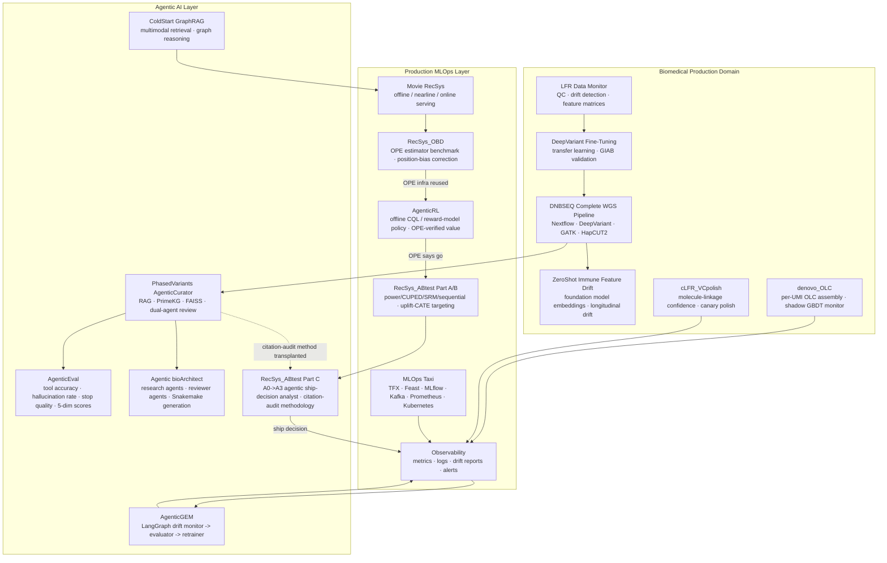

# Production Agentic AI & MLOps Portfolio

## Agentic AI x Production MLOps x Domain Knowledge  

My work sits at the intersection of three factors:


1. **Agentic AI**: multi-agent orchestration, RAG, tool use, reflection loops, evaluator agents, and human-in-the-loop quality gates.
2. **MLOps**: production ML pipelines, monitoring, drift detection, model retraining, serving, observability, and deployment.
3. **Biomedical domain knowledge**: genomics, variant calling, phasing, sequencing QC, immune aging, and clinical interpretation.

The unifying theme is not simply building models or agents. It is building working agentic loops that can survive real production conditions: noisy data, model drift, long-running workflows, unreliable tool calls, audit requirements, and the need to decide when automation should stop and ask for human review.


## Three Core Signals

1. **Implemented production-style agentic closed loops**: monitor -> evaluate -> decide -> act -> validate. These loops appear in biomedical variant interpretation, bioinformatics pipeline design, sequencing drift response, and ads-ranking retraining.
2. **Designed for agentic stability**: the projects directly address the failure modes that make agents hard to deploy, especially multi-step error compounding, tool-use unreliability, weak evaluation, context degradation, missing observability, and uncontrolled automation.
3. **Product-caliber judgment**: every project starts from an explicit problem/pain-point framing rather than a solution looking for a use case, makes architecture trade-offs explicit instead of defaulting to "add an agent," and treats a positive-looking result as a hypothesis to stress-test — not a conclusion to ship.

---

## Architecture, Requirements, and Critical Thinking

Agents can now deliver fast — refactor a codebase, retune a pipeline, and report whether a metric moved — and that speed is becoming a commodity: pointing an agent at a target and getting a quick answer is no longer what differentiates one contributor from another. What agents do not supply on their own sits upstream and downstream of that speed: deciding what the system should actually be optimizing before anything runs, and recognizing when a fast, confident-looking result is wrong. That is the same judgment a strong PM or a senior scientist brings to a roadmap review — and it is demonstrated directly in this portfolio, not just claimed:

| Capability | What It Looks Like Here | Evidence |
|---|---|---|
| **Problem framing / defining what to optimize** | Every project starts by deciding what the system should actually optimize rather than accepting the first metric on offer — an explicit pain-point or open-question framing, not a solution looking for a use case; designs get re-scoped once they turn out not to answer the real question | The 7-pain-point enterprise agentic AI framework (BioMed portfolio); RecSys_OBD's "two open problems that make OPE hard in practice"; PhasedVariants' Step 4 finding that generator and evaluator "share a model family and prompt lineage, so no number produced inside that loop can certify it" — which triggered a redesign to route correctness checks to external sources |
| **Architecture & trade-off design** | Deliberate, argued decisions about where determinism, rules, ML, and LLM judgment each belong — not a default of "add an agent everywhere" | PhasedVariants' "Hybrid Rule-Based + Agentic" architecture-rationale table; denovo_OLC's evidence ladder (fast path → anchor extension → collective rescue, escalating only when needed) and its three evaluated ML-integration schemes; the Integrated System View diagram below, composing 12 projects across two domains into one production lifecycle |
| **Critical thinking / catching a confidently-wrong result** | A fast, confident-looking result — the kind a model or an agent hands back after one pass — gets stress-tested before being trusted, not shipped on the strength of its own reported number; negative and disqualifying findings are disclosed and shape the final design rather than being filed away | denovo_OLC's six rejected model-in-the-loop paths, including a classifier with AUC 0.9995 that turned out to predict the wrong target with a reversed discrimination direction — a textbook confidently-wrong result; cLFR_VCpolish's disclosed chr15/chr19 anomaly and a rejected "fix" that improved one chromosome while making the genome-wide result net negative; RecSys_OBD's causal-boundary test proving a bias correction that looks justified can still increase error; PhasedVariants' concordance benchmark showing "revision helps" and "revision hurts" are both true, model-dependently — a single-model run would have produced a false general claim |

These aren't incidental footnotes — they're the discipline that keeps a system honest after it ships, which is what separates a demo from a product.

---

## Portfolio Thesis

Production agentic AI becomes deployable only when the loop is closed: agents must observe system state, make bounded decisions, trigger retraining or refinement, validate outputs, and escalate when confidence is insufficient.

An agent that calls a degraded model, retrieves stale context, silently compounds errors, or cannot explain its tool path is not production-ready. My projects therefore treat agentic AI as one layer in a larger system:

```text
Domain data -> ML pipeline -> monitoring -> drift decision -> retraining / fallback
            -> agentic orchestration -> evaluation -> human review -> deployment
```

This portfolio demonstrates end-to-end ownership across that lifecycle, with stability mechanisms built into the agentic loop rather than added as afterthoughts:

- **Domain grounding**: biomedical projects use real genomics workflows, variant evidence, sequencing QC, and foundation model representations.
- **Agent reliability**: agentic projects include planning, retrieval grounding, reflection, evaluator agents, explicit stop criteria, and hallucination checks.
- **Production readiness**: MLOps projects include feature stores, model registries, drift monitoring, Prometheus/Grafana-style observability, Kubernetes deployment, and automated retraining loops.

---

## Fit with AI-Accelerated Drug Development & Precision Medicine

Public reporting on "AI accelerating drug development" usually bundles three distinct mechanisms: generative structure/molecule design (AlphaFold, diffusion-based protein design), LLM-assisted interpretation of literature and omics data for target discovery, and agentic automation of the bioinformatics pipelines that feed those models. This portfolio's biomedical work sits in the second and third layers, plus the data-reliability layer both depend on — not in molecule/chemistry design or clinical trial operations. That scope is a deliberate boundary, not a gap.

| Layer in AI-accelerated drug/precision-medicine pipelines | Known limitation reported in the field | Portfolio evidence |
|---|---|---|
| **Reliable genomic/omics data substrate** | Sequencing throughput has outpaced analysis capacity; data quality, not model capability, is the reported bottleneck for downstream target-ID and interpretation models | LFR Data Monitor (QC drift detection before it reaches variant calling); DeepVariant fine-tuning (detect → retrain → validate under distribution shift); DNBSEQ WGS Pipeline (auditable, reproducible calling) |
| **Evidence-grounded target/variant interpretation** | Surveys of LLMs in drug discovery report that text-only LLM output is fluent but "unreliable for target and drug prioritization without cohort-specific quantitative evidence" | PhasedVariants AgenticCurator routes correctness checks to external structured sources (ClinGen/ClinVar) instead of the model's self-reported citations, after finding those citations unresolvable — the same fix the literature calls for |
| **Agentic bioinformatics pipeline automation** | "Agentic bioinformatics" is described as an emerging paradigm for pipeline design, with few production-grade examples published | Agentic bioArchitect (multi-agent pipeline design with reviewer-gated iteration); denovo_OLC's evidence ladder (escalating to a model only when a cheap rule is insufficient) |

This is also the layer where genomics/diagnostics companies (e.g., Natera, Tempus) and functional-genomics-first drug discovery companies (e.g., Recursion, Insitro) spend most of their engineering effort — closer to what these projects actually do than a claim of doing molecule design or trial simulation would be.

---

## Fit with Current AI4S (AI for Science) Pain Points

A consensus is forming in 2026's AI4S discourse: an agent completing a workflow is not the same as the workflow's conclusion being trustworthy. That distinction is the framing this portfolio was designed around from the start — not a disclaimer added after the fact.

| AI4S Pain Point (2026 industry/academic reporting) | Portfolio Evidence |
|---|---|
| A mid-2026 benchmark of agentic bioinformatics found the dominant failure mode is **planning error** — wrong reference genome, ignored study design, inappropriate statistics, confidence exceeding what the evidence supports — not execution faults; a workflow can "complete" and still produce an unreliable biological conclusion | denovo_OLC's six rejected model-in-the-loop paths, including a classifier with AUC 0.9995 that predicted the wrong target entirely — a textbook case of "ran cleanly, wrong conclusion"; PhasedVariants AgenticCurator routes correctness checks outside the model's own loop, to external ClinGen/ClinVar evidence, after finding the generator's self-reported citations were unresolvable |
| Reproducibility literature warns that unstated genome, annotation, and tool versions produce false discrepancies, and that measurement-to-dataset pipelines should be treated as auditable inference components rather than black-box preprocessing | DNBSEQ Complete WGS Pipeline's containerized, configurable caller/aligner design for reproducibility; LFR Data Monitor's per-run feature matrix turning sequencing QC into a trackable monitoring problem; cLFR_VCpolish's chromosome-held-out cross-validation with disclosed, not silently patched, chr15/chr19 anomalies |
| The field broadly reports that data-driven AI4S models lack the correctness guarantees of traditional scientific computing and can produce misleading conclusions, while rising retractions and reproducibility failures raise doubts about science's own capacity to self-correct | The portfolio-wide discipline of disclosing negative and disqualifying findings rather than filing them away — RecSys_OBD's causal-boundary test falsifying a bias correction that looks justified; AgenticRL falsifying the intuitive "richer logging implies a better policy" hypothesis; denovo_OLC and cLFR_VCpolish disclosing rather than masking anomalous results |
| Generative foundation-model applications in chemistry/biology/materials (molecule design, protein structure prediction) face distinct trustworthiness and physical-consistency challenges — currently one of AI4S's most invested-in yet hardest-to-verify directions | Out of scope for this portfolio by design — the work here focuses on evidence-grounded interpretation and verified bioinformatics pipeline automation, not molecule/structure generation, consistent with the scope boundary noted in the drug-development section above |

In short, this portfolio already addresses the core pain point repeatedly raised in 2026 AI4S discussions: a completed workflow is not a trustworthy conclusion. Auditability, external evidence verification, and honestly disclosing negative results are what's missing — and hardest to productionize — in agentic AI4S systems today.

---

## Factor Coverage

| Project | Biomedical | Agentic AI | MLOps / Production ML | Core Signal |
|---|:---:|:---:|:---:|---|
| [DNBSEQ Complete WGS Pipeline](https://github.com/Complete-Genomics/DNBSEQ_Complete_WGS) | Yes |  | Yes | Production genomics pipeline with auditable, reproducible WGS analysis |
| [LFR Data Monitor](https://github.com/arcadianlyric/LFR_DataMonitor) | Yes |  | Yes | Sequencing QC and drift detection before model degradation becomes silent |
| [Google DeepVariant Fine-Tuning](https://github.com/arcadianlyric/GoogleDeepVariant_FineTuning) | Yes |  | Yes | Detect -> retrain -> validate pattern for shifted sequencing distributions |
| [PhasedVariants AgenticCurator](https://github.com/arcadianlyric/PhasedVariants_AgenticCurator) | Yes | Yes | Yes | Three-agent sprint harness with external-evidence evaluation (ClinGen/ClinVar) and deterministic scoring for grounded variant interpretation |
| [AgenticEval](https://github.com/arcadianlyric/AgenticEval) |  | Yes | Yes | Reusable eval framework for agent traces: tool accuracy, hallucination rate, stop-decision quality, 5-dim scoring |
| [Agentic bioArchitect](https://github.com/arcadianlyric/Agentic_bioArchitect) | Yes | Yes | Yes | Multi-agent design and implementation of bioinformatics pipelines |
| [ZeroShot Immune Feature Drift](https://github.com/arcadianlyric/ZeroShot_ImmuneFeatureDrift) | Yes |  | Yes | Foundation model embedding drift for longitudinal immune monitoring |
| [denovo_OLC](https://github.com/Complete-Genomics/cLFR_denovo_OLC) | Yes |  | Yes | Evidence-aware per-UMI assembly; rule-vs-ML-vs-shadow-model production decision with six rejected model-in-the-loop paths |
| [cLFR_VCpolish](https://github.com/Complete-Genomics/cLFR_SNVpolish) | Yes |  | Yes | LightGBM molecule-linkage confidence scoring for post-consensus SNV polish, shipped canary-gated |
| [AgenticGEM DataDrift AutoRetrainer](https://github.com/arcadianlyric/AgenticGEM_DataDrift_AutoRetrainer) |  | Yes | Yes | LangGraph monitor -> evaluate -> retrain loop for ads ranking drift |
| [MLOps Taxi Platform](https://github.com/arcadianlyric/Agentic_MLOps_Platform) |  |  | Yes | Full production ML platform with TFX, Feast, MLflow, Kafka, and observability |
| [RS ColdStart GraphRAG LLM](https://github.com/arcadianlyric/RS_coldstart_graphRAG_LLM) |  | Yes | Yes | Multimodal GraphRAG for cold-start recommendation |
| [Movie RecSys](https://github.com/arcadianlyric/RS_movies) |  |  | Yes | Hybrid recommendation stack with offline, nearline, and online serving layers |
| [RecSys_OBD](https://github.com/arcadianlyric/RecSys_OBD) |  |  | Yes | Off-policy evaluation benchmark: data-scale-dependent estimator selection and a falsifiable causal boundary for position-bias correction |
| [AgenticRL](https://github.com/arcadianlyric/AgenticRL) |  |  | Yes | Offline RL (Conservative Q-Learning) trained on real logged bandit data, verified through RecSys_OBD's own OPE pipeline — checks that CQL's conservative-penalty design goal actually holds, and falsifies "richer logging signal implies a better policy" |
| [RecSys_ABtest](https://github.com/arcadianlyric/RecSys_ABtest) |  | Yes | Yes | A/B analysis toolkit (power/CUPED/SRM/sequential testing) + uplift/CATE targeting, closed by an ablation-laddered LLM agent that judges ship-decisions against constructed trap ground truth |

---

## Agentic Stability Pain Points I Address

| Pain Point | Why It Breaks Production | Portfolio Evidence |
|---|---|---|
| Multi-step error compounding | A 95% reliable step becomes unreliable across long chains | AgenticCurator review loop; bioArchitect researcher -> analyst -> reviewer workflow |
| Tool-use unreliability | Agents hallucinate parameters, call tools in the wrong order, or miss failures | Structured retrieval wrappers, explicit tool outputs, cross-model review; **RecSys_ABtest**'s deterministic function-calling layer, where the agent can only obtain numbers via tool calls and never computes them itself |
| Evaluation gap | Teams cannot deploy agents without measurable quality gates | **AgenticEval** deterministic trace evaluator; AgenticCurator's external-evidence layer and ClinGen concordance benchmark; RecSys_OBD's ground-truthed OPE estimator benchmark; chromosome-held-out CV in cLFR_VCpolish; **RecSys_ABtest**'s 10-trap constructed-ground-truth ship-decision benchmark (100% trap recall, 0% numeric hallucination once tool-calling is added); **AgenticRL**'s checked, not assumed, verification that CQL's conservative penalty compresses an 8x offline-RL overestimation failure to 2.2% of ground truth |
| Observability blindness | Failures are hard to debug without traces, metrics, and lineage | MLOps Taxi monitoring stack; LFR drift feature matrices; Prometheus metrics in AgenticGEM; denovo_OLC's shadow-model disagreement monitoring |
| Context degradation | Long sessions and poor retrieval cause agents to reason from weak context | FAISS grounding, knowledge graph context, progressive literature search |
| Human-in-the-loop design | Agents either over-ask humans or continue when they should stop | Quality thresholds, revise/stop logic, escalation decisions; **RecSys_ABtest**'s A0->A3 ablation ladder, where a second-model skeptical verifier gates the ship/escalate decision |
| Production drift | ML tools degrade when input distributions shift | LFR DataMonitor, DeepVariant fine-tuning, AgenticGEM retraining loop, ZeroShot drift metrics, denovo_OLC's explicit drift-gated retraining workflow |

---

## Integrated System View


```mermaid
flowchart TD
    subgraph DOMAIN["Biomedical Production Domain"]
        WGS["DNBSEQ Complete WGS Pipeline<br/>Nextflow · DeepVariant · GATK · HapCUT2"]
        LFR["LFR Data Monitor<br/>QC · drift detection · feature matrices"]
        DV["DeepVariant Fine-Tuning<br/>transfer learning · GIAB validation"]
        IMM["ZeroShot Immune Feature Drift<br/>foundation model embeddings · longitudinal drift"]
        OLC["denovo_OLC<br/>per-UMI OLC assembly · shadow GBDT monitor"]
        VCP["cLFR_VCpolish<br/>molecule-linkage confidence · canary polish"]
    end

    subgraph AGENT["Agentic AI Layer"]
        CUR["PhasedVariants AgenticCurator<br/>RAG · PrimeKG · FAISS · dual-agent review"]
        EVAL["AgenticEval<br/>tool accuracy · hallucination rate · stop quality · 5-dim scores"]
        BIO["Agentic bioArchitect<br/>research agents · reviewer agents · Snakemake generation"]
        GEM["AgenticGEM<br/>LangGraph drift monitor -> evaluator -> retrainer"]
        GRAG["ColdStart GraphRAG<br/>multimodal retrieval · graph reasoning"]
        ABT["RecSys_ABtest Part C<br/>A0->A3 agentic ship-decision analyst · citation-audit methodology"]
    end

    subgraph MLOPS["Production MLOps Layer"]
        TAXI["MLOps Taxi<br/>TFX · Feast · MLflow · Kafka · Prometheus · Kubernetes"]
        RECSYS["Movie RecSys<br/>offline / nearline / online serving"]
        OBD["RecSys_OBD<br/>OPE estimator benchmark · position-bias correction"]
        RL["AgenticRL<br/>offline CQL / reward-model policy · OPE-verified value"]
        ABAB["RecSys_ABtest Part A/B<br/>power/CUPED/SRM/sequential · uplift-CATE targeting"]
        OBS["Observability<br/>metrics · logs · drift reports · alerts"]
    end

    LFR --> DV
    DV --> WGS
    WGS --> CUR
    WGS --> IMM
    CUR --> EVAL
    CUR --> BIO
    CUR -. "citation-audit method transplanted" .-> ABT
    OLC --> OBS
    VCP --> OBS
    GEM --> OBS
    TAXI --> OBS
    RECSYS --> OBD
    OBD -- "OPE infra reused" --> RL
    RL -- "OPE says go" --> ABAB
    ABAB --> ABT
    ABT -- "ship decision" --> OBS
    GRAG --> RECSYS
    OBS --> GEM
```

This view shows the same operating principle across domains:

1. Build a reliable ML or data pipeline.
2. Instrument it with monitoring and drift detection.
3. Use agents where multi-step reasoning, retrieval, or orchestration adds leverage.
4. Add evaluation, reflection, and stop criteria so the agent can be trusted.
5. Close the loop with retraining, fallback, escalation, or human review.

---

## Project Narratives

### 1. Biomedical Production ML Foundation

The biomedical projects show that I understand production constraints before adding agents.

- **DNBSEQ Complete WGS Pipeline** demonstrates reproducible genomics production: Nextflow DSL2, containerized tools, variant calling, phasing, structural variants, and configurable callers.
- **LFR Data Monitor** turns sequencing QC into an ML monitoring problem by extracting per-run features and detecting distribution shifts before they affect downstream calling quality.
- **Google DeepVariant Fine-Tuning** closes the loop by adapting pretrained DeepVariant models to shifted sequencing distributions using transfer learning and GIAB-based validation.
- **ZeroShot Immune Feature Drift** extends the same drift mindset to foundation model embeddings, tracking immune aging signals without overfitting small biological datasets.
- **denovo_OLC** assembles linked-read isoform pools with a graph-aware ML prefilter, then documents six separate attempts to let a model choose the final contig — all rejected for the same failure mode — before shipping a cheaper, auditable rule as the production default and demoting the model to a shadow-only monitor.
- **cLFR_VCpolish** trains a molecule-linkage confidence model with chromosome-held-out cross-validation on two independent GIAB samples, ships it disabled-by-default as a canary, and documents rather than silently patches the chromosomes where the feature set underperforms.

Together, these projects represent the production substrate: data quality, model quality, reproducibility, drift awareness, and validation.

### 2. Domain-Specific Agentic AI

The agentic biomedical projects focus on constrained automation rather than unconstrained chat.

- **PhasedVariants AgenticCurator** automates interpretation of phased variants using RAG, PrimeKG, VEP annotations, literature retrieval, and FAISS grounding, orchestrated by a three-agent sprint harness (Planner → Generator ↔ Evaluator) that negotiates deliverables before generating and routes correctness checks to sources outside the model's own loop — objective citation audits and a frozen ClinGen/ClinVar gold set — after finding the generator's self-reported citations were unresolvable. A 600-task concordance benchmark across two models found both share a structural failure at separating ClinGen's Moderate/Disputed/Refuted tiers, so the architecture now has the LLM extract evidence while a deterministic scoring engine computes the classification.
- **AgenticEval** abstracts the evaluation layer from AgenticCurator into a reusable framework. Any agent trace—from LangGraph, CrewAI, or custom Python loops—can be scored for tool accuracy, hallucination rate, stop-decision quality, and a five-dimension rubric, enabling CI-gated regression testing across projects.
- **Agentic bioArchitect** uses multi-agent collaboration to design and implement bioinformatics pipelines, with reviewer agents and score thresholds controlling whether the workflow proceeds or iterates.

These systems address the hard parts of agent deployment: evidence grounding, tool reliability, hallucination detection, review loops, and explicit stopping criteria.

### 3. General Production MLOps and Recommendation Systems

The recommendation and MLOps projects show that the same production principles transfer outside biomedicine.

- **MLOps Taxi** implements a complete production ML platform: TFX pipelines, Feast feature store, MLflow registry, Kafka streaming, FastAPI serving, DVC versioning, Prometheus/Grafana observability, and Kubernetes deployment.
- **AgenticGEM DataDrift AutoRetrainer** applies agentic decision-making to production ads ranking: a LangGraph state machine evaluates drift reports and decides whether to retrain, skip, or escalate.
- **RS ColdStart GraphRAG LLM** uses multimodal retrieval and graph reasoning to solve cold-start recommendation problems.
- **Movie RecSys** demonstrates offline, nearline, and online recommendation serving with hybrid ranking and fallbacks.
- **RecSys_OBD** benchmarks six off-policy evaluation estimators against verified ground truth on a real e-commerce logging dataset, finding a bias-variance crossover that yields a data-scale-dependent estimator selection rule, and uses a ground-truthed synthetic stress test to establish exactly when position-bias correction helps versus adds noise — the evaluation discipline a ranking policy needs before it ships.
- **AgenticRL** trains offline RL (Conservative Q-Learning) and reward-model policies directly on OBD's real logged transitions, then reuses RecSys_OBD's own OPE estimators, unmodified, to price each policy's value against ground truth before any online exposure. The checked result: CQL's conservative penalty compresses an 8x offline-RL overestimation failure to within 2.2% of ground truth on the `random` log — but the natural follow-up hypothesis, that a richer adaptive log (`bts`) should train a better policy, is falsified by a positivity/overlap violation that degrades every estimator instead of improving it.
- **RecSys_ABtest** closes the loop once OPE says a policy is worth testing: an A/B analysis toolkit (power/MDE, CUPED, SRM, sequential testing, delta method) validates the lift online, S/T/X-learner uplift modeling identifies who should get it, and — reusing the citation-audit methodology from PhasedVariants AgenticCurator — an ablation-laddered agentic experiment analyst (A0 raw numbers → A3 tool-calling + structured planning + skeptical verifier) judges whether a given readout can be trusted enough to ship, scored against a 10-trap constructed ground truth (100% trap recall, 0% numeric hallucination by A1).

**RecSys_OBD, AgenticRL, and RecSys_ABtest form a single closed loop** — a *RecSys Decision Intelligence Pipeline* that mirrors the biomedical monitor → retrain → validate loop, applied to ranking/ads decisions instead of variant calls: RecSys_OBD builds and validates the OPE infrastructure; AgenticRL trains a new policy offline and prices it with that same infrastructure; RecSys_ABtest validates the result online and supplies the agentic judgment on whether it should ship.

These projects make the portfolio broader than biomedicine while preserving the same core thesis: production AI requires lifecycle engineering, not isolated models.

---

## What This Portfolio Demonstrates

### For Biomedical ML Roles

- Deep familiarity with sequencing workflows, variant calling, phasing, QC, drift, and clinical interpretation.
- Ability to connect ML systems to domain-specific failure modes rather than treating data as generic tables.
- Experience translating research-grade models into monitored, auditable workflows.
- Rigorous production-ML evaluation discipline: chromosome-held-out cross-validation, calibration, shadow/canary deployment, and disclosing rather than silently patching anomalous results.

### For Agentic AI Roles

- Agent systems with planning, retrieval, tool use, reflection, evaluator agents, and quality gates.
- Practical awareness of agent failure modes: hallucination, context decay, tool-call errors, and long-horizon error compounding.
- Agentic workflows designed around explicit state, evidence, scoring, and escalation.
- Cross-domain methodology reuse: RecSys_ABtest transplants PhasedVariants AgenticCurator's citation-audit design into a statistic-attribution audit, with its A0→A3 ablation ladder driving numeric hallucination to 0% once tool-calling is added.

### For MLOps / Production ML Roles

- End-to-end production lifecycle: ingestion, validation, feature engineering, training, registry, serving, monitoring, drift detection, and retraining.
- Familiarity with production infrastructure: TFX, Feast, MLflow, Kafka, Redis, FastAPI, Docker, Kubernetes, Prometheus, Grafana, DVC.
- Ability to build feedback loops where model behavior is measured, acted on, and improved.
- Offline-to-online decision pipelines: RecSys_OBD's OPE infrastructure reused unmodified by AgenticRL to price an offline RL policy before any online exposure, then closed by RecSys_ABtest's A/B validation and uplift targeting.

---

## Positioning Statement

I build production AI systems where domain knowledge, agentic reasoning, and MLOps reinforce each other.

In biomedical ML, I understand that model quality depends on sequencing chemistry, QC, variant representation, and clinical evidence. In agentic AI, I understand that automation must be grounded, evaluated, observable, and interruptible. In MLOps, I understand that deployment is a lifecycle: monitor, detect drift, retrain, validate, serve, and audit.

That combination lets me design agentic systems that are not just impressive demos, but realistic production applications.

As AI increasingly writes the code itself, the differentiating skill shifts toward exactly this: framing the right problem, architecting a system that will actually hold up in production, and knowing when a result is trustworthy versus merely plausible. That is the judgment this portfolio is built to demonstrate.
