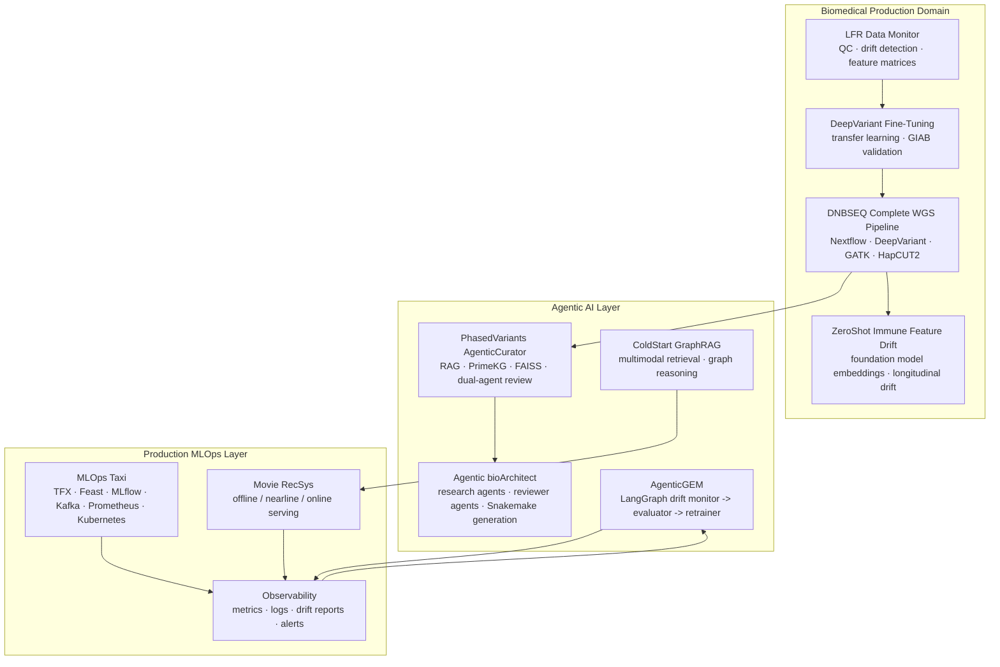

# 生产级 Agentic AI 与 MLOps 项目集

## Agentic AI x 生产级 MLOps x 领域知识

这个 portfolio 的核心不是单独展示几个模型或几个 agent demo，而是展示我如何把 **领域知识、agentic 系统设计、生产级机器学习工程** 放在同一个真实部署框架里思考。

我的项目围绕三个 factor 展开：

1. **Biomedical domain knowledge**：基因组学、变异检测、phasing、测序 QC、免疫衰老、临床变异解读。
2. **Agentic AI**：多智能体协作、RAG、工具调用、reflection loop、评估 agent、human-in-the-loop 质量门控。
3. **MLOps**：生产 pipeline、监控、数据漂移检测、模型再训练、模型服务、可观测性、部署与审计。

贯穿这些项目的一条主线是：真正可用的 agentic AI 不能只停留在问答或 demo 层面。我强调的是已经实现的生产式 agentic 闭环：它必须能面对生产环境中的噪声数据、模型漂移、长流程错误累积、工具调用失败、审计要求，以及什么时候继续自动化、什么时候停止并请求人工判断的问题。

## 两个核心信号

1. **实现了生产式 agentic 闭环**：monitor -> evaluate -> decide -> act -> validate。这个闭环体现在 biomedical variant interpretation、生信 pipeline 设计、测序漂移响应，以及 ads-ranking 自动再训练中。
2. **面向 agentic 稳定性设计**：这些项目不是只展示 agent 能调用工具，而是直接处理 agent 难以部署的稳定性痛点，尤其是多步错误累积、工具调用不可靠、评估缺口、上下文退化、可观测性不足和自动化失控。

---

## Portfolio Thesis

**生产级 Agentic AI 的关键是闭环，而不是单次回答。** Agent 必须能观察系统状态、做有边界的决策、触发 retraining 或 refinement、验证输出，并在信心不足时升级到人工判断。

如果一个 agent 调用了已经退化的模型、检索了过期或错误的上下文、在多步流程中不断累积错误，或者无法解释自己调用了什么工具、为什么调用、哪一步失败，那么它就还不具备生产部署价值。

因此，我的项目把 agentic AI 看作生产 ML 系统中的一层，而不是孤立的聊天机器人：

```text
Domain data -> ML pipeline -> monitoring -> drift decision -> retraining / fallback
            -> agentic orchestration -> evaluation -> human review -> deployment
```

这个 portfolio 展示的是完整生命周期能力，并且把稳定性机制内建到 agentic 闭环中，而不是事后补救：

- **领域 grounding**：生物医学项目基于真实的基因组 pipeline、测序 QC、变异证据、临床解读和 foundation model 表征。
- **Agent reliability**：agentic 项目包含 planning、retrieval grounding、reflection、evaluator agent、显式停止条件和 hallucination 检查。
- **Production readiness**：MLOps 项目覆盖 feature store、model registry、drift monitoring、Prometheus/Grafana 可观测性、Kubernetes 部署和自动再训练闭环。

---

## Factor 覆盖矩阵

| 项目 | Biomedical | Agentic AI | MLOps / Production ML | 核心能力信号 |
|---|:---:|:---:|:---:|---|
| [DNBSEQ Complete WGS Pipeline](https://github.com/Complete-Genomics/DNBSEQ_Complete_WGS) | Yes |  | Yes | 可审计、可复现的生产级全基因组分析 pipeline |
| [LFR Data Monitor](https://github.com/arcadianlyric/LFR_DataMonitor) | Yes |  | Yes | 测序 QC 与漂移检测，在模型静默退化前发出信号 |
| [Google DeepVariant Fine-Tuning](https://github.com/arcadianlyric/GoogleDeepVariant_FineTuning) | Yes |  | Yes | 面向测序分布变化的 detect -> retrain -> validate 闭环 |
| [PhasedVariants AgenticCurator](https://github.com/arcadianlyric/PhasedVariants_AgenticCurator) | Yes | Yes | Yes | RAG + KG + 双 agent review 的变异解读系统 |
| [Agentic bioArchitect](https://github.com/arcadianlyric/Agentic_bioArchitect) | Yes | Yes | Yes | 多 agent 设计并生成生信 pipeline，带 reviewer 与质量门控 |
| [ZeroShot Immune Feature Drift](https://github.com/arcadianlyric/ZeroShot_ImmuneFeatureDrift) | Yes |  | Yes | 用 foundation model embedding 监控纵向免疫漂移 |
| [AgenticGEM DataDrift AutoRetrainer](https://github.com/arcadianlyric/AgenticGEM_DataDrift_AutoRetrainer) |  | Yes | Yes | LangGraph monitor -> evaluate -> retrain 广告排序漂移闭环 |
| [MLOps Taxi](https://github.com/arcadianlyric/MLops_taxi) |  |  | Yes | TFX、Feast、MLflow、Kafka、可观测性组成的完整 ML 平台 |
| [RS ColdStart GraphRAG LLM](https://github.com/arcadianlyric/RS_coldstart_graphRAG_LLM) |  | Yes | Yes | 多模态 GraphRAG 解决冷启动推荐问题 |
| [Movie RecSys](https://github.com/arcadianlyric/RS_movies) |  |  | Yes | offline / nearline / online 三层推荐服务架构 |

---

## 我重点解决的 Agentic 稳定性问题

| 问题 | 为什么会影响生产部署 | 项目证据 |
|---|---|---|
| 多步错误累积 | 单步 95% 准确率在长链路中会快速下降 | AgenticCurator review loop；bioArchitect researcher -> analyst -> reviewer 流程 |
| 工具调用不可靠 | Agent 可能 hallucinate 参数、调用顺序错误、或忽略 silent failure | 结构化 tool wrapper、显式 tool output、cross-model review |
| 评估缺口 | 没有质量指标就无法稳定部署 agent | AgenticCurator 五维评分；AgenticGEM 自动化测试 |
| 可观测性缺失 | 无法追踪长流程中是哪一步造成失败 | MLOps Taxi monitoring stack；LFR drift feature matrix；AgenticGEM Prometheus metrics |
| 上下文退化 | 长会话和弱检索会让 agent 基于错误 context 推理 | FAISS grounding、knowledge graph context、progressive literature search |
| Human-in-the-loop 设计 | Agent 既不能过度打扰人，也不能在该停止时继续自动化 | 质量阈值、revise/stop 逻辑、escalation decision |
| 生产漂移 | 输入分布变化会让 ML 工具静默退化 | LFR DataMonitor、DeepVariant fine-tuning、AgenticGEM retraining loop、ZeroShot drift metrics |

---

## Integrated System View



这个系统图表达的是同一套工程原则在不同领域中的复用：

1. 先建立可靠的 ML 或数据 pipeline。
2. 给 pipeline 加上监控、漂移检测和质量反馈。
3. 在多步推理、检索、工具编排有价值的地方引入 agent。
4. 给 agent 加上 evaluation、reflection 和停止条件。
5. 通过 retraining、fallback、escalation 或 human review 形成闭环。

---

## 项目叙事

### 1. Biomedical Production ML Foundation

这些项目说明我在加入 agent 之前，先理解生产环境中的生物医学约束。

- **DNBSEQ Complete WGS Pipeline**：生产级 WGS pipeline，包含 Nextflow DSL2、容器化工具、variant calling、phasing、SV、可配置 caller 和 aligner。
- **LFR Data Monitor**：把测序 QC 转化成 ML monitoring 问题，通过 per-run feature matrix 检测输入分布变化，避免下游 variant calling 质量静默退化。
- **Google DeepVariant Fine-Tuning**：用 transfer learning 适配 shifted sequencing distribution，并用 GIAB truth set 做验证，形成 detect -> retrain -> validate 的 MLOps 闭环。
- **ZeroShot Immune Feature Drift**：把 drift 思维扩展到 foundation model embedding，用于纵向 PBMC / immune aging 信号监控，避免在小样本生物数据上过拟合。

这些项目构成我的生产基础能力：数据质量、模型质量、可复现性、漂移意识和验证闭环。

### 2. Domain-Specific Agentic AI

这些 agentic biomedical 项目强调的是有约束的自动化，而不是开放式聊天。

- **PhasedVariants AgenticCurator**：使用 RAG、PrimeKG、VEP annotation、literature retrieval、FAISS grounding 和 dual-agent review 自动化 phased variant interpretation。
- **Agentic bioArchitect**：使用多 agent 协作完成生信 pipeline 的研究、设计和实现，并通过 reviewer agent 和 score threshold 控制是否进入下一步或继续迭代。

这些系统聚焦 agent 部署中的关键难题：证据 grounding、工具可靠性、hallucination 检测、review loop、显式停止条件和 human-in-the-loop。

### 3. General Production MLOps and Recommendation Systems

推荐系统和通用 MLOps 项目说明同样的生产原则可以迁移到非生物医学领域。

- **MLOps Taxi**：完整生产 ML 平台，覆盖 TFX pipeline、Feast feature store、MLflow registry、Kafka streaming、FastAPI serving、DVC versioning、Prometheus/Grafana observability 和 Kubernetes deployment。
- **AgenticGEM DataDrift AutoRetrainer**：把 agentic decision-making 用到广告排序漂移处理，用 LangGraph state machine 读取 drift report，并决定 retrain、skip 或 escalate。
- **RS ColdStart GraphRAG LLM**：用 multimodal retrieval 和 graph reasoning 解决推荐系统中的 cold-start 问题。
- **Movie RecSys**：展示 offline、nearline、online 三层推荐服务架构，以及 hybrid ranking 和 fallback 设计。

这些项目让 portfolio 不局限于生物医学，同时保持同一个核心观点：生产 AI 是生命周期工程，不是单个模型或单个 agent。

---

## 这个 Portfolio 体现的能力

### 面向 Biomedical ML 岗位

- 熟悉 sequencing workflow、variant calling、phasing、QC、drift 和临床变异解读。
- 能把 ML 系统连接到领域特定 failure mode，而不是把生物数据当成普通表格数据处理。
- 具备把研究型模型转化为可监控、可验证、可审计 workflow 的能力。

### 面向 Agentic AI 岗位

- 设计过包含 planning、retrieval、tool use、reflection、evaluator agent 和 quality gate 的 agent 系统。
- 理解 agent 的真实失败模式：hallucination、context decay、tool-call error、多步错误累积。
- 能围绕显式 state、证据、评分和 escalation 设计 agentic workflow。

### 面向 MLOps / Production ML 岗位

- 覆盖完整生产生命周期：ingestion、validation、feature engineering、training、registry、serving、monitoring、drift detection、retraining。
- 熟悉 TFX、Feast、MLflow、Kafka、Redis、FastAPI、Docker、Kubernetes、Prometheus、Grafana、DVC 等生产组件。
- 能构建 feedback loop，让模型行为被度量、被解释、被触发行动并持续改进。

---

## Positioning Statement

我构建的是 **domain knowledge、agentic reasoning 和 MLOps 相互增强的生产 AI 系统**。

在 biomedical ML 中，我理解模型质量不仅取决于算法，还取决于测序 chemistry、QC、variant representation 和临床证据链。在 agentic AI 中，我理解自动化必须是 grounded、evaluated、observable、interruptible 的。在 MLOps 中，我理解部署不是终点，而是 monitor、detect drift、retrain、validate、serve、audit 的持续生命周期。

这个组合让我能够设计的不只是好看的 agent demo，而是更接近真实生产环境的 agentic AI 应用。
