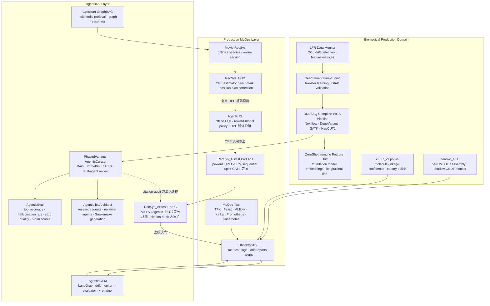

# 生产级 Agentic AI 与 MLOps 项目集

## Agentic AI x 生产级 MLOps x 领域知识

这个 portfolio 的核心不是单独展示几个模型或几个 agent demo，而是展示我如何把 **领域知识、agentic 系统设计、生产级机器学习工程** 放在同一个真实部署框架里思考。

我的项目围绕三个 factor 展开：

1. **Agentic AI**：多智能体协作、RAG、工具调用、reflection loop、评估 agent、human-in-the-loop 质量门控。
2. **MLOps**：生产 ML pipeline、监控、数据漂移检测、模型再训练、模型服务、可观测性、部署与审计。
3. **Biomedical domain knowledge**：基因组学、变异检测、phasing、测序 QC、免疫衰老、临床变异解读。

贯穿这些项目的一条主线是：真正可用的 agentic AI 不能只停留在问答或 demo 层面。我强调的是已经实现的生产式 agentic 闭环：它必须能面对生产环境中的噪声数据、模型漂移、长流程错误累积、工具调用失败、审计要求，以及什么时候继续自动化、什么时候停止并请求人工判断的问题。


## 三个核心信号

1. **实现了生产式 agentic 闭环**：monitor -> evaluate -> decide -> act -> validate。这个闭环体现在 biomedical variant interpretation、生信 pipeline 设计、测序漂移响应，以及 ads-ranking 自动再训练中。
2. **面向 agentic 稳定性设计**：这些项目不是只展示 agent 能调用工具，而是直接处理 agent 难以部署的稳定性痛点，尤其是多步错误累积、工具调用不可靠、评估缺口、上下文退化、可观测性不足和自动化失控。
3. **产品级判断力**：每个项目都从明确的问题/痛点定义出发，而不是先有方案再找场景；架构上的取舍都被显式论证，而不是默认"哪里都加个 agent"；任何看起来是正面结果的发现，都被当作待压力测试的假设，而不是可以直接上线的结论。

---

## 架构、需求洞察与批判性思维

Agent 现在已经能"快速交付"——重构一段代码、重调一个 pipeline、跑一遍并报告指标有没有变好——而这种速度正在快速商品化：让 agent 对着一个目标跑一遍、拿到一个答案，已经不再是区分一个人和另一个人的地方。Agent 自己给不了的东西，在这个速度的**上游和下游**：先判断这个系统到底该优化什么，而不是接受它给出的第一个指标；以及识别一个跑得快、看起来很自信的结果什么时候其实是错的。这正是一个优秀 PM 或资深科学家在评审 roadmap 时所依赖的判断力——而这个 portfolio 是直接把它做出来给你看，而不是停留在自我宣称：

| 能力 | 在这个 Portfolio 里的体现 | 证据 |
|---|---|---|
| **需求洞察 / 定义该优化什么** | 每个项目都先判断系统到底该优化什么，而不是接受摆在面前的第一个指标——从明确的痛点或未解决问题出发，而不是先有方案再找场景；一旦发现原有设计答不了真正的问题，就会重新定义范围 | BioMed portfolio 的 7 个企业级 agentic AI 痛点框架；RecSys_OBD 提出的"让 OPE 在实践中变难的两个开放问题"；PhasedVariants Step 4 发现"生成器和评估器共享同一个模型家族和 prompt 谱系，因此这个循环内部产出的任何数字都无法自证"——这个发现直接触发了架构重设计，把正确性校验路由到外部信源 |
| **架构与取舍设计** | 对确定性规则、ML、LLM 判断各自该用在哪里，做出经过论证的主动选择，而不是默认"到处加 agent" | PhasedVariants 的"混合规则+Agentic"架构论证表；denovo_OLC 的分级证据阶梯（快速路径 → 锚点延伸 → 集体救援，只在必要时才升级）及其评估过的三种 ML 集成方案；下方 Integrated System View 图——把两个领域、12 个项目组合成一套完整的生产生命周期 |
| **批判性思维 / 识别 agent 自信但错的情况** | 一个跑得快、看起来很自信的结果——无论是模型还是 agent 跑一遍给出来的——在被信任之前都会先被压力测试，而不是因为它自己报出来的数字好看就直接上线；负面和证伪性的发现会被公开并反过来影响最终设计，而不是被搁置不提 | denovo_OLC 六条被否决的"让模型直接介入决策"路径，其中一个分类器 AUC 高达 0.9995，却是预测了错误的目标且判别方向相反——一个教科书级的"自信但错"案例；cLFR_VCpolish 公开了 chr15/chr19 异常，并否决了一个能改善单条染色体、却让全基因组结果净变差的"修复方案"；RecSys_OBD 的因果边界测试证明一个看似正当的偏差修正也可能让误差变大；PhasedVariants 的一致性基准测试表明"修订有帮助"和"修订有害"在不同模型上都成立——只跑单一模型会得出错误的普适性结论 |

这些不是无关紧要的旁注——它们是系统上线后仍能保持诚实所需要的纪律，也正是 demo 和产品的分界线。

---

## Portfolio Thesis

**生产级 Agentic AI 的关键是闭环，而不是单次回答。** Agent 必须能观察系统状态、做有边界的决策、触发 retraining 或 refinement、验证输出，并在信心不足时升级到人工判断。

如果一个 agent 调用了已经退化的模型、检索了过期或错误的上下文、在多步流程中不断累积错误，或者无法解释自己调用了什么工具、为什么调用、哪一步失败，那么它就还不具备生产部署价值。

因此，我的项目把 agentic AI 看作生产 ML 系统中的一层，而不是孤立的聊天机器人：

```text
Domain data -> ML pipeline -> monitoring -> drift decision -> retraining / fallback
            -> agentic orchestration -> evaluation -> human review -> deployment
```

这个 portfolio 展示的是完整生命周期能力，并且把稳定性机制内建到 agentic 闭环中，而不是事后补救：

- **领域 grounding**：生物医学项目基于真实的基因组 pipeline、测序 QC、变异证据、临床解读和 foundation model 表征。
- **Agent reliability**：agentic 项目包含 planning、retrieval grounding、reflection、evaluator agent、显式停止条件和 hallucination 检查。
- **Production readiness**：MLOps 项目覆盖 feature store、model registry、drift monitoring、Prometheus/Grafana 可观测性、Kubernetes 部署和自动再训练闭环。

---

## 与 AI 加速药物研发 / 精准医疗的契合度

关于"AI 加速药物研发"的报道通常把至少三种不同机制混在一起：生成式结构/分子设计（AlphaFold、基于扩散模型的蛋白设计）、LLM 辅助的文献与组学数据解读（用于靶点发现）、以及支撑这些模型的生信 pipeline 的 agentic 自动化。这个 portfolio 的生物医学工作落在第二层和第三层，以及两者都依赖的数据可靠性层——不涉及分子/化学设计或临床试验运营。这是有意为之的范围边界，而不是缺口。

| AI 加速药物研发/精准医疗 pipeline 中的层级 | 行业报告中的已知局限 | Portfolio 证据 |
|---|---|---|
| **可靠的基因组/组学数据底座** | 测序通量已超过分析能力，数据质量而非模型能力，是下游靶点发现和解读模型的报告瓶颈 | LFR Data Monitor（在进入 variant calling 前检测 QC 漂移）；DeepVariant fine-tuning（分布漂移下的 detect → retrain → validate）；DNBSEQ WGS Pipeline（可审计、可复现的 calling） |
| **证据锚定的靶点/变异解读** | 关于 LLM 在药物发现中应用的综述指出，纯文本的 LLM 输出流畅，但"在缺乏队列特异定量证据支撑时，不足以用于靶点和药物优先级排序" | PhasedVariants AgenticCurator 在发现生成器自报引用完全无法解析后，把正确性校验路由到外部结构化信源（ClinGen/ClinVar），而非依赖模型自报——这正是文献指出应有的修复方式 |
| **生信 pipeline 的 agentic 自动化** | "Agentic bioinformatics" 被行业文献描述为新兴范式，但公开的生产级案例仍然很少 | Agentic bioArchitect（reviewer 门控迭代的多智能体 pipeline 设计）；denovo_OLC 的证据阶梯（只在便宜规则不够用时才升级到模型） |

这也正是基因组学/诊断类公司（如 Natera、Tempus）和以功能基因组学为起点的药物发现公司（如 Recursion、Insitro）投入工程精力最多的层级——比起声称在做分子设计或临床试验模拟，这更贴近这些项目实际在做的事情。

---

## 与 AI4S（AI for Science）现状痛点的对应

2026 年的 AI4S 讨论中，一个共识正在浮现：agent 能"跑完"一个分析流程，不等于它给出的结论可信——这正是这个 portfolio 从设计之初就采用的框架，而不是事后补的免责声明。

| AI4S 现状痛点（2026 年行业/学界报告） | Portfolio 证据 |
|---|---|
| 2026 年中一项针对 agentic bioinformatics 的基准测试发现：主要失败模式是 **planning error**（用错参考基因组、忽略研究设计、选错统计方法、对结果的置信度超过证据支持），而非执行错误——一个"跑完了"的 workflow 仍可能给出不可靠的生物学结论 | denovo_OLC 记录的六条被否决的"模型直接决策"路径，其中一个 AUC 0.9995 的分类器预测了错误目标——正是"跑得漂亮但结论错"的教科书案例；PhasedVariants AgenticCurator 发现生成器自报引用完全无法解析后，把正确性判定移出模型自身循环，路由到外部 ClinGen/ClinVar 证据源 |
| Reproducibility 文献指出：未被记录的基因组版本、注释版本、工具版本会制造"假的"结果差异；measurement-to-dataset pipeline 本身应被当作可审计的 inference component，而不是黑箱预处理步骤 | DNBSEQ Complete WGS Pipeline 的容器化、可配置 caller/aligner 设计保证可复现性；LFR Data Monitor 的 per-run feature matrix 把测序 QC 变成可追踪的监控问题；cLFR_VCpolish 按染色体留出交叉验证，并如实公开 chr15/chr19 的异常表现，而非静默调参掩盖 |
| 学界普遍指出：AI4S 的数据驱动模型缺乏传统科学计算的正确性保证，可能在真实场景中给出误导性结论；同时科研体系本身的自我纠错能力正被质疑（retraction 与复现失败增多） | 贯穿全 portfolio 的"负面/证伪发现照常公开"纪律——RecSys_OBD 的因果边界测试证伪一个看似合理的偏差修正；AgenticRL 证伪"日志信号越丰富策略越好"这一直觉假设；denovo_OLC 与 cLFR_VCpolish 对异常结果选择公开而非掩盖 |
| Foundation model 在 chemistry/biology/materials 中的生成式应用（分子设计、蛋白结构预测）面临独特的可信度与物理一致性挑战，是当前 AI4S 投入最集中但也最难验证的方向之一 | 不在这个 portfolio 的范围内——这里的工作聚焦证据锚定的解读与生信 pipeline 自动化验证，而非分子/结构生成，是有意为之的范围边界（与上面"AI 加速药物研发"一节的结论一致） |

换句话说，这个 portfolio 已经在正面回应 2026 年 AI4S 领域被反复提及的核心痛点：agent 完成了流程不代表结论可信；可审计性、外部证据校验，以及诚实地公开负面结果，才是当前 agentic AI4S 系统最缺、也最难量产的能力。

---

## Factor 覆盖矩阵

| 项目 | Biomedical | Agentic AI | MLOps / Production ML | 核心能力信号 |
|---|:---:|:---:|:---:|---|
| [DNBSEQ Complete WGS Pipeline](https://github.com/Complete-Genomics/DNBSEQ_Complete_WGS) | Yes |  | Yes | 可审计、可复现的生产级全基因组分析 pipeline |
| [LFR Data Monitor](https://github.com/arcadianlyric/LFR_DataMonitor) | Yes |  | Yes | 测序 QC 与漂移检测，在模型静默退化前发出信号 |
| [Google DeepVariant Fine-Tuning](https://github.com/arcadianlyric/GoogleDeepVariant_FineTuning) | Yes |  | Yes | 面向测序分布变化的 detect -> retrain -> validate 闭环 |
| [PhasedVariants AgenticCurator](https://github.com/arcadianlyric/PhasedVariants_AgenticCurator) | Yes | Yes | Yes | 三智能体 sprint harness，结合外部证据评估（ClinGen/ClinVar）与确定性打分的变异解读系统 |
| [AgenticEval](https://github.com/arcadianlyric/AgenticEval) |  | Yes | Yes | 通用 agent trace 评估框架：工具准确率、幻觉率、停止决策质量、五维评分 |
| [Agentic bioArchitect](https://github.com/arcadianlyric/Agentic_bioArchitect) | Yes | Yes | Yes | 多 agent 设计并生成生信 pipeline，带 reviewer 与质量门控 |
| [ZeroShot Immune Feature Drift](https://github.com/arcadianlyric/ZeroShot_ImmuneFeatureDrift) | Yes |  | Yes | 用 foundation model embedding 监控纵向免疫漂移 |
| [denovo_OLC](https://github.com/Complete-Genomics/cLFR_denovo_OLC) | Yes |  | Yes | 证据感知的逐 UMI 组装；规则 vs. ML vs. 影子模型的生产决策，六条模型介入路径均被否决 |
| [cLFR_VCpolish](https://github.com/Complete-Genomics/cLFR_SNVpolish) | Yes |  | Yes | LightGBM 分子连锁置信度打分，用于共识后 SNV 抛光，以金丝雀模式上线 |
| [AgenticGEM DataDrift AutoRetrainer](https://github.com/arcadianlyric/AgenticGEM_DataDrift_AutoRetrainer) |  | Yes | Yes | LangGraph monitor -> evaluate -> retrain 广告排序漂移闭环 |
| [MLOps Taxi Platform](https://github.com/arcadianlyric/Agentic_MLOps_Platform) |  |  | Yes | TFX、Feast、MLflow、Kafka、可观测性组成的完整 ML 平台 |
| [RS ColdStart GraphRAG LLM](https://github.com/arcadianlyric/RS_coldstart_graphRAG_LLM) |  | Yes | Yes | 多模态 GraphRAG 解决冷启动推荐问题 |
| [Movie RecSys](https://github.com/arcadianlyric/RS_movies) |  |  | Yes | offline / nearline / online 三层推荐服务架构 |
| [RecSys_OBD](https://github.com/arcadianlyric/RecSys_OBD) |  |  | Yes | 离线策略评估（OPE）基准测试：按数据规模选择估计器，并为位置偏差修正给出可证伪的因果边界 |
| [AgenticRL](https://github.com/arcadianlyric/AgenticRL) |  |  | Yes | 在真实 logged bandit 数据上训练离线 RL（Conservative Q-Learning），复用 RecSys_OBD 自己的 OPE pipeline 做验证——实测 CQL 的保守惩罚设计目标是否真的成立，并证伪了"日志信号越丰富策略越好"这一假设 |
| [RecSys_ABtest](https://github.com/arcadianlyric/RecSys_ABtest) |  | Yes | Yes | A/B 分析工具箱（power/CUPED/SRM/sequential testing）+ uplift/CATE 定向投放，由一个消融阶梯式 LLM agent 对照构造陷阱 ground truth 做上线判断收尾 |

---

## 我重点解决的 Agentic 稳定性问题

| 问题 | 为什么会影响生产部署 | 项目证据 |
|---|---|---|
| 多步错误累积 | 单步 95% 准确率在长链路中会快速下降 | AgenticCurator review loop；bioArchitect researcher -> analyst -> reviewer 流程 |
| 工具调用不可靠 | Agent 可能 hallucinate 参数、调用顺序错误、或忽略 silent failure | 结构化 tool wrapper、显式 tool output、cross-model review；**RecSys_ABtest** 的确定性 function-calling 层——agent 只能通过 tool call 获取数字，永远不能自己算 |
| 评估缺口 | 没有质量指标就无法稳定部署 agent | **AgenticEval** 确定性 trace 评估框架；AgenticCurator 的外部证据评估层与 ClinGen 一致性基准；RecSys_OBD 带 ground truth 的 OPE 估计器基准；cLFR_VCpolish 的按染色体留出交叉验证；**RecSys_ABtest** 基于 10 类构造陷阱 ground truth 的上线决策基准（100% 陷阱召回率，加入 tool-calling 后数值幻觉率 0%）；**AgenticRL** 对 CQL 保守惩罚设计目标的实测验证——把一次 8 倍的离线 RL 高估失效压缩到与 ground truth 相差 2.2% |
| 可观测性缺失 | 无法追踪长流程中是哪一步造成失败 | MLOps Taxi monitoring stack；LFR drift feature matrix；AgenticGEM Prometheus metrics；denovo_OLC 的影子模型分歧率监控 |
| 上下文退化 | 长会话和弱检索会让 agent 基于错误 context 推理 | FAISS grounding、knowledge graph context、progressive literature search |
| Human-in-the-loop 设计 | Agent 既不能过度打扰人，也不能在该停止时继续自动化 | 质量阈值、revise/stop 逻辑、escalation decision；**RecSys_ABtest** 的 A0->A3 消融阶梯，由第二个模型担任 skeptical verifier 把关上线/升级决策 |
| 生产漂移 | 输入分布变化会让 ML 工具静默退化 | LFR DataMonitor、DeepVariant fine-tuning、AgenticGEM retraining loop、ZeroShot drift metrics、denovo_OLC 显式的漂移触发再训练流程 |

---

## Integrated System View


```mermaid
flowchart TD
    subgraph DOMAIN["Biomedical Production Domain"]
        WGS["DNBSEQ Complete WGS Pipeline<br/>Nextflow · DeepVariant · GATK · HapCUT2"]
        LFR["LFR Data Monitor<br/>QC · drift detection · feature matrices"]
        DV["DeepVariant Fine-Tuning<br/>transfer learning · GIAB validation"]
        IMM["ZeroShot Immune Feature Drift<br/>foundation model embeddings · longitudinal drift"]
        OLC["denovo_OLC<br/>per-UMI OLC assembly · shadow GBDT monitor"]
        VCP["cLFR_VCpolish<br/>molecule-linkage confidence · canary polish"]
    end

    subgraph AGENT["Agentic AI Layer"]
        CUR["PhasedVariants AgenticCurator<br/>RAG · PrimeKG · FAISS · dual-agent review"]
        EVAL["AgenticEval<br/>tool accuracy · hallucination rate · stop quality · 5-dim scores"]
        BIO["Agentic bioArchitect<br/>research agents · reviewer agents · Snakemake generation"]
        GEM["AgenticGEM<br/>LangGraph drift monitor -> evaluator -> retrainer"]
        GRAG["ColdStart GraphRAG<br/>multimodal retrieval · graph reasoning"]
        ABT["RecSys_ABtest Part C<br/>A0->A3 agentic 上线决策分析师 · citation-audit 方法论"]
    end

    subgraph MLOPS["Production MLOps Layer"]
        TAXI["MLOps Taxi<br/>TFX · Feast · MLflow · Kafka · Prometheus · Kubernetes"]
        RECSYS["Movie RecSys<br/>offline / nearline / online serving"]
        OBD["RecSys_OBD<br/>OPE estimator benchmark · position-bias correction"]
        RL["AgenticRL<br/>offline CQL / reward-model policy · OPE 验证价值"]
        ABAB["RecSys_ABtest Part A/B<br/>power/CUPED/SRM/sequential · uplift-CATE 定向"]
        OBS["Observability<br/>metrics · logs · drift reports · alerts"]
    end

    LFR --> DV
    DV --> WGS
    WGS --> CUR
    WGS --> IMM
    CUR --> EVAL
    CUR --> BIO
    CUR -. "citation-audit 方法论迁移" .-> ABT
    OLC --> OBS
    VCP --> OBS
    GEM --> OBS
    TAXI --> OBS
    RECSYS --> OBD
    OBD -- "复用 OPE 基础设施" --> RL
    RL -- "OPE 说可以上" --> ABAB
    ABAB --> ABT
    ABT -- "上线决策" --> OBS
    GRAG --> RECSYS
    OBS --> GEM
```

这个系统图表达的是同一套工程原则在不同领域中的复用：

1. 先建立可靠的 ML 或数据 pipeline。
2. 给 pipeline 加上监控、漂移检测和质量反馈。
3. 在多步推理、检索、工具编排有价值的地方引入 agent。
4. 给 agent 加上 evaluation、reflection 和停止条件。
5. 通过 retraining、fallback、escalation 或 human review 形成闭环。

---

## 项目叙事

### 1. Biomedical Production ML Foundation

这些项目说明我在加入 agent 之前，先理解生产环境中的生物医学约束。

- **DNBSEQ Complete WGS Pipeline**：生产级 WGS pipeline，包含 Nextflow DSL2、容器化工具、variant calling、phasing、SV、可配置 caller 和 aligner。
- **LFR Data Monitor**：把测序 QC 转化成 ML monitoring 问题，通过 per-run feature matrix 检测输入分布变化，避免下游 variant calling 质量静默退化。
- **Google DeepVariant Fine-Tuning**：用 transfer learning 适配 shifted sequencing distribution，并用 GIAB truth set 做验证，形成 detect -> retrain -> validate 的 MLOps 闭环。
- **ZeroShot Immune Feature Drift**：把 drift 思维扩展到 foundation model embedding，用于纵向 PBMC / immune aging 信号监控，避免在小样本生物数据上过拟合。
- **denovo_OLC**：用图感知 ML 预筛选组装 linked-read 转录本读段池，同时记录了六次"让模型直接选 contig"的尝试——全部因同一种失效模式被否决——最终把更便宜、可审计的规则设为生产默认值，把模型降级为纯影子监控。
- **cLFR_VCpolish**：在两个独立的 GIAB 样本上用按染色体留出交叉验证训练分子连锁置信度模型，以默认关闭的金丝雀模式上线，对表现不佳的染色体如实记录而非静默打补丁。

这些项目构成我的生产基础能力：数据质量、模型质量、可复现性、漂移意识和验证闭环。

### 2. Domain-Specific Agentic AI

这些 agentic biomedical 项目强调的是有约束的自动化，而不是开放式聊天。

- **PhasedVariants AgenticCurator**：使用 RAG、PrimeKG、VEP annotation、literature retrieval 和 FAISS grounding 自动化 phased variant interpretation，由三智能体 sprint harness（Planner → Generator ↔ Evaluator）编排——每次生成前先协商交付标准，并把正确性校验路由到模型自身循环之外的信源：客观的引用审计和一份冻结的 ClinGen/ClinVar 金标准集，原因是发现生成器自报的引用完全无法解析。基于两个模型的 600 任务一致性基准测试发现，二者都存在同样的结构性缺陷——分不清 ClinGen 的 Moderate/Disputed/Refuted 分级，因此架构调整为让 LLM 只负责抽取证据，由一个确定性打分引擎计算最终分级。
- **AgenticEval**：从 AgenticCurator 中抽象出通用 agent 评估层。任意 agent trace（LangGraph、CrewAI、自定义 Python 循环）均可输入，输出工具准确率、幻觉率、停止决策质量和五维评分，支持 CI 回归测试门控。
- **Agentic bioArchitect**：使用多 agent 协作完成生信 pipeline 的研究、设计和实现，并通过 reviewer agent 和 score threshold 控制是否进入下一步或继续迭代。

这些系统聚焦 agent 部署中的关键难题：证据 grounding、工具可靠性、hallucination 检测、review loop、显式停止条件和 human-in-the-loop。

### 3. General Production MLOps and Recommendation Systems

推荐系统和通用 MLOps 项目说明同样的生产原则可以迁移到非生物医学领域。

- **MLOps Taxi**：完整生产 ML 平台，覆盖 TFX pipeline、Feast feature store、MLflow registry、Kafka streaming、FastAPI serving、DVC versioning、Prometheus/Grafana observability 和 Kubernetes deployment。
- **AgenticGEM DataDrift AutoRetrainer**：把 agentic decision-making 用到广告排序漂移处理，用 LangGraph state machine 读取 drift report，并决定 retrain、skip 或 escalate。
- **RS ColdStart GraphRAG LLM**：用 multimodal retrieval 和 graph reasoning 解决推荐系统中的 cold-start 问题。
- **Movie RecSys**：展示 offline、nearline、online 三层推荐服务架构，以及 hybrid ranking 和 fallback 设计。
- **RecSys_OBD**：在一个真实电商日志数据集上，用可验证的 ground truth 对六种离线策略评估（OPE）估计器做基准测试，发现的偏差-方差交叉点给出了按数据规模选择估计器的实用规则；并用一个带 ground truth 的合成压力测试，精确界定位置偏差修正何时有效、何时只是引入噪声——这正是一个排序策略上线前所需要的评估纪律。
- **AgenticRL**：直接在 OBD 真实 logged transitions 上训练离线 RL（Conservative Q-Learning）和 reward-model 策略，再原样复用 RecSys_OBD 自己的 OPE 估计器，在没有任何线上曝光的前提下给每个策略的价值定价、对照 ground truth 校验。实测结果：CQL 的保守惩罚在 `random` 日志上把一次 8 倍的离线 RL 高估失效压缩到与 ground truth 仅相差 2.2%；但紧接着的自然假设——更丰富的自适应日志（`bts`）应该能训出更好的策略——被证伪了：`bts` 的集中曝光违反了 positivity/overlap 假设，让每一个估计器的表现都变差，而不是变好。
- **RecSys_ABtest**：在 OPE 判断"这个策略值得一试"之后接棒收尾——A/B 分析工具箱（power/MDE、CUPED、SRM、sequential testing、delta method）负责线上验证 lift 是否真实，S/T/X-learner uplift 建模负责找出该给谁上；并且复用 PhasedVariants AgenticCurator 的 citation-audit 方法论，做出一个消融阶梯式的 agentic 实验分析师（A0 裸数字 → A3 tool-calling + 结构化 planning + skeptical verifier），对照 10 类构造陷阱 ground truth 判断一份实验读数是否可信到可以上线（100% 陷阱召回率，A1 起数值幻觉率即为 0%）。

**RecSys_OBD、AgenticRL、RecSys_ABtest 三者构成一条完整闭环**——一条 *RecSys Decision Intelligence Pipeline*，与生物医学项目里的 monitor → retrain → validate 闭环遥相呼应，只是把对象从 variant call 换成了排序/广告决策：RecSys_OBD 搭建并验证 OPE 基础设施；AgenticRL 离线训练新策略，并用同一套基础设施为它定价；RecSys_ABtest 在线上验证结果，并给出是否该上线的 agentic 判断。

这些项目让 portfolio 不局限于生物医学，同时保持同一个核心观点：生产 AI 是生命周期工程，不是单个模型或单个 agent。

---

## 这个 Portfolio 体现的能力

### 面向 Biomedical ML 岗位

- 熟悉 sequencing workflow、variant calling、phasing、QC、drift 和临床变异解读。
- 能把 ML 系统连接到领域特定 failure mode，而不是把生物数据当成普通表格数据处理。
- 具备把研究型模型转化为可监控、可验证、可审计 workflow 的能力。
- 严谨的生产级 ML 评估方法论：按染色体留出交叉验证、概率校准、影子/金丝雀部署，以及对异常结果如实公开而非静默打补丁。

### 面向 Agentic AI 岗位

- 设计过包含 planning、retrieval、tool use、reflection、evaluator agent 和 quality gate 的 agent 系统。
- 理解 agent 的真实失败模式：hallucination、context decay、tool-call error、多步错误累积。
- 能围绕显式 state、证据、评分和 escalation 设计 agentic workflow。
- 跨领域方法论复用：RecSys_ABtest 把 PhasedVariants AgenticCurator 的 citation-audit 设计移植成统计归因审计，其 A0→A3 消融阶梯让数值幻觉率在加入 tool-calling 后降到 0%。

### 面向 MLOps / Production ML 岗位

- 覆盖完整生产生命周期：ingestion、validation、feature engineering、training、registry、serving、monitoring、drift detection、retraining。
- 熟悉 TFX、Feast、MLflow、Kafka、Redis、FastAPI、Docker、Kubernetes、Prometheus、Grafana、DVC 等生产组件。
- 能构建 feedback loop，让模型行为被度量、被解释、被触发行动并持续改进。
- 离线到线上的决策闭环：RecSys_OBD 的 OPE 基础设施被 AgenticRL 原样复用，在没有任何线上曝光前给离线 RL 策略定价，再由 RecSys_ABtest 的 A/B 验证和 uplift 定向收尾。

---

## Positioning Statement

我构建的是 **domain knowledge、agentic reasoning 和 MLOps 相互增强的生产 AI 系统**。

在 biomedical ML 中，我理解模型质量不仅取决于算法，还取决于测序 chemistry、QC、variant representation 和临床证据链。在 agentic AI 中，我理解自动化必须是 grounded、evaluated、observable、interruptible 的。在 MLOps 中，我理解部署不是终点，而是 monitor、detect drift、retrain、validate、serve、audit 的持续生命周期。

这个组合让我能够设计的不只是好看的 agent demo，而是更接近真实生产环境的 agentic AI 应用。

当 AI 越来越能自己写代码，真正拉开差距的能力正在转向：定义对的问题、架构出真正能扛住生产环境的系统，以及分辨一个结果是真的可信还是只是看起来可信。这正是这个 portfolio 想要证明的判断力。
